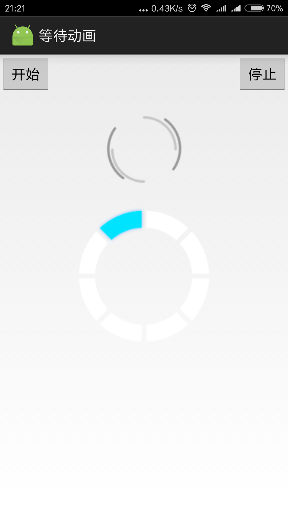

# Android等待动画
> 等待连接中等待动画
> 分别利用旋转动画和逐帧动画实现等待动画。


## 旋转动画
> 用大小不一的两个圆分别做内圈和外圈来实现连接过程的等待动画。大圆和小圆的旋转方向相反，并且旋转速度不一样。

### 开发步骤

#### 在布局文件中设置两个圆的布局
将两个圆放置在帧布局中，这样就可以实现内外两个圆的效果。代码如下：
``` xml
   <FrameLayout
        android:layout_marginBottom="20dp"
        android:layout_gravity="center"
        android:layout_width="wrap_content"
        android:layout_height="wrap_content">

        <ImageView
            android:id="@+id/imgLoading0"
            android:src="@drawable/loading0"
            android:layout_width="wrap_content"
            android:layout_height="wrap_content" />

        <ImageView
            android:id="@+id/imgLoading1"
            android:src="@drawable/loading1"
            android:layout_width="wrap_content"
            android:layout_height="wrap_content" />
    </FrameLayout>
```

#### 建立旋转动画配置文件
在res目录下新建anim目录，并在anim目录下新建内外两个旋转动画的配置文件。

inside_rotate_anim.xml
``` xml
<?xml version="1.0" encoding="utf-8"?>
<set xmlns:android="http://schemas.android.com/apk/res/android">
    <rotate
        android:fromDegrees="0"
        android:toDegrees="-360"
        android:duration="1000"
        android:repeatCount="-1"
        android:pivotX="50%"
        android:pivotY="50%" />
</set>
```

outer_rotate_anim.xml
``` xml 
<?xml version="1.0" encoding="utf-8"?>
<set xmlns:android="http://schemas.android.com/apk/res/android">
    <rotate
        android:fromDegrees="0"
        android:toDegrees="360"
        android:duration="1500"
        android:repeatCount="-1"
        android:pivotX="50%"
        android:pivotY="50%" />
</set>
```

fromeDegrees: 旋转的起始角度
toDegrees   : 旋转的结束角度
duration    : 从起始角度到结束角度所需要的时间
repeatCount : 重复次数，-1表示永不停止
pivotX      : 旋转中心位置
pivotY      : 旋转中心位置

#### 定义Animation和ImageView对象
``` java
    private ImageView m_imgInsideCircle; //内圆
    private ImageView m_imgOuterCircle;  //外圆

    private Animation m_animInsideCircle; //内圆动画
    private Animation m_animOuterCircle;  //外圆动画
```

#### 获取图片资源
``` java
        m_imgInsideCircle = (ImageView) findViewById(R.id.imgInsideCircle);
        m_imgOuterCircle = (ImageView) findViewById(R.id.imgOuterCircle);
```

#### 加载动画并设置旋转速度
``` Java 
        m_animInsideCircle = AnimationUtils.loadAnimation(this, R.anim.inside_rotate_anim);
        m_animInsideCircle.setInterpolator(new LinearInterpolator()); //设置旋转速度为匀速

        m_animOuterCircle = AnimationUtils.loadAnimation(this, R.anim.outer_rotate_anim);
        m_animOuterCircle.setInterpolator(new LinearInterpolator()); //设置旋转速度为匀速
```

#### 开始和停止动画
``` java
    private void startAnimation() {
        m_imgInsideCircle.startAnimation(m_animInsideCircle);
        m_imgOuterCircle.startAnimation(m_animOuterCircle);
    }

    private void stopAnimation() {
        m_imgInsideCircle.clearAnimation();
        m_imgOuterCircle.clearAnimation();
    }
```


## 逐帧动画
> Frame动画是一系列图片按照一定的顺序展示的过程，和放电影的机制很相似，我们称为逐帧动画。Frame动画可以被定义在XML文件中，也可以完全编码实现。

### 开发步骤

#### 定义资源文件设置动画帧
在res目录下新建anim目录，并在anim目录下新建逐帧动画的配置文件:frame_anim.xml
``` xml
<?xml version="1.0" encoding="utf-8"?>
<animation-list xmlns:android="http://schemas.android.com/apk/res/android">
    <item android:drawable="@drawable/wait0" android:duration="200" />
    <item android:drawable="@drawable/wait1" android:duration="200" />
    <item android:drawable="@drawable/wait2" android:duration="200" />
    <item android:drawable="@drawable/wait3" android:duration="200" />
    <item android:drawable="@drawable/wait4" android:duration="200" />
    <item android:drawable="@drawable/wait5" android:duration="200" />
    <item android:drawable="@drawable/wait6" android:duration="200" />
    <item android:drawable="@drawable/wait7" android:duration="200" />
</animation-list>
```
既然逐帧动画是需要播放一帧一帧的图像，所以需要为其添加帧。在Android中提供了两种方式为AnimationDrawable添加帧：XML定义的资源文件和Java代码创建。定义逐帧动画非常简单，只要在<animation-list.../>元素中使用<item.../>子元素定义动画的全部帧，并制定各帧的持续时间即可。

#### 将逐帧动画设置为ImageView控件背景
```
<ImageView
        android:layout_gravity="center_horizontal"
        android:id="@+id/frameAnim"
        android:background="@anim/frame_anim"
        android:layout_width="wrap_content"
        android:layout_height="wrap_content" />
```

#### 定义AnimationDrawable对象
> 在Android中逐帧动画需要得到AnimationDrawable类的支持，它位于"android.graphics.drawable.AnimationDrawable"包下，是Drawable的间接子类。它主要用来创建一个逐帧动画，并且可以对帧进行拉伸，把它设置为View的背景即可使用AnimationDrawable.start()方法播放。
```java
    private AnimationDrawable m_frameAnim;
```

#### 获得图片资源并已图片背景作为AnimationDrawable实例化对象
``` java
    ImageView imgView = (ImageView) findViewById(R.id.frameAnimWait);
    m_frameAnim = (AnimationDrawable) imgView.getBackground();
```

#### 逐帧动画开始和停止
``` java
    m_frameAnim.start(); //开始动画
    m_frameAnim.stop();  //停止动画
```

## Demo源代码地址
[https://github.com/dezhihuang/WaitAnimation](https://github.com/dezhihuang/WaitAnimation)


## Demo结果
Demo演示结果如下，上面一个图为内外两个圆所组成的旋转动画，下面一个图为多个图片组成的逐帧动画。


